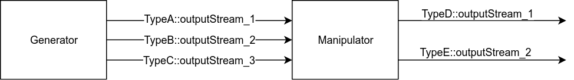

# Micro Application With Middleware Interfaces

## **What It Is About**
A mock application consists of a sender (class `GenerateDataStream`, declared in file _GenerateDataStream.hpp_) transmitting data to a receiver (class `ManipulateDataStream`, defined in _ManipulateDataStream.hpp_). Hereafter, the sender as well as the receiver will be referred to as a Generator _component_ and the Manipulator _component_.
The communication link**s** between the sender and the receiver is over three different types. Specifically, each link between the sender and the receiver is of a different data-type (i.e., a different C++ class.) A simple model of the setup is shown in Figure below.



It is assumed that the connection between the Generator and the Manipulator may be implemented via a middleware, e.g., an operating system via pipes, or a specialized middleware such as those in automotive systems via dedicated publish and read APIs.


## **Objective**
Demonstrate the following:
- [x] Calling a method e.g., `filter` of a set of classes with a single call in a component.
- [x] Calling a client defined `customFilter` method specific to each class, but executing the `customFilter` for all input (or output) channels with a single method invocation.  

## **For The Impatient**
Read `main.cpp`.

## **Building the Project**
Execute `./buildProject.sh`.

## **Requirements**
1. Google AllTests
2. GCC v.5.4 or better, Clang-6.0.0 or better.
3. Valgrind, when the application is built in `RELEASE` mode. See `CMakeLists.txt` for details.

## **Relevance of the Objectives**
1. _The `filter` Method_ : This is useful in cases when one or more similar housekeeping operations across all types are required. In case of an application hosted on a middleware stack, each _port_ (or output channel) must execute a pre-determined method, typically with a similar name, to hand-off data to the middleware, or to receive it, or to filter it. In the example presented here, each type (e.g., `TypeA`, `TypeB`, ... provides an implementation of a method `filter`. In other setups, one may have a method `pushData` supported by each class which takes care of serialization and then copy-over of serialized data to the communications driver.).


2. _The `customFilter` Method_ : The `customFilter` models the case wherein a customer application would like to apply its own rules to pre- or post-process data from all relevant input (or output) streams. It is also required that the `customFilter` is not known to the vendor (e.g., of the middleware) but must only support being invoked with an instance of a customer supplied filter.


(_click to download the full resolution picture_)

## **Relevance to Software Quality**
**The `filter` Method**

In the context of an application executing on top of a middleware, a hypervisor, or an operating system (hereafter, the "middleware"), it is often the case that housekeeping calls are exchanged between the application and the middleware in order to compute, or exchange data. Usually, these calls must be made on a per (`C++` type) channel, e.g., `TypeA` making up for a significant amount of _boilerplate_ code, while also making the code-base more erroneous.
On the otherhand, the the developer invokes one method, here, `filter` from the scope of the application, whereas the enumeration to type-specific method is done by the compiler. Specifically, the developer invokes `filter` whereas the compiler expands the call to `TypeA::filter`, `TypeB::filter`, and so on.

**The `customFilter` Method**

The `customFilter` method provides an approach to run type-specific logic, such as signal pre-processing _specific_ to a given channel, and update the logic with a simple change such as specifying the class of the logic, e.g., ``MyApp`` as shown in the picture above.
The pre-processing logic need not be known to the vendor of the type (i.e., the owner of types `TypeA`, ...). The vendor must only allow for an abstract class, `AbstractFilter` containing the method `filter`, which is then filled by the customer.

```c++
void customFilter(AbstractFilter &filter) { filter.filter(*this); }
```

which is declared as:
```c++
#ifndef ABSTRACTFILTER_HPP_
#define ABSTRACTFILTER_HPP_
class TypeA;
// more types

class AbstractFilter {
public:
  AbstractFilter() = default;
  virtual void filter(TypeA &a) = 0;
  // declare filter method for other types
  //
  virtual ~AbstractFilter() = default;
};
#endif // !ABSTRACTFILTER_HPP_
```
In the example presented here, the `customFilter` method of the receiver component `manipulator` is called like below:
```c++
manipulator.myCustomFilter();
```

The `ManipulateDataStream::myCustomFilter()` is implemented as shown below.
Notice that separate calls to the `filter` method for each specific input and output channel for the `manipulator` component is not performed by the developer.
Instead, the enumeration to type-specific `filter` methods is performed by the compiler itself.

```c++
void ManipulateDataStream::myCustomFilter() {
  Filter<NotMyApp> filter;
  this->allInterfaces.customInputFilter(filter);
}
```

## **Technical Challenges**
Major technical challenges worked on in this project:

1. Compiler-assisted expansion of `filter` into type-specific `TypeA::filter`,  `TypeB::filter`, ... methods.
2. Enable support for customer specific logic specific for each type owned by the vendor of the type, e.g., `TypeA`, while ensuring that the vendor does not have access to the customer-specific logic. This is a straightforward implementation of the _vistor design pattern_.

## **Also**
Google Tests are available in the folder _GoogleTests/AllTests_.
